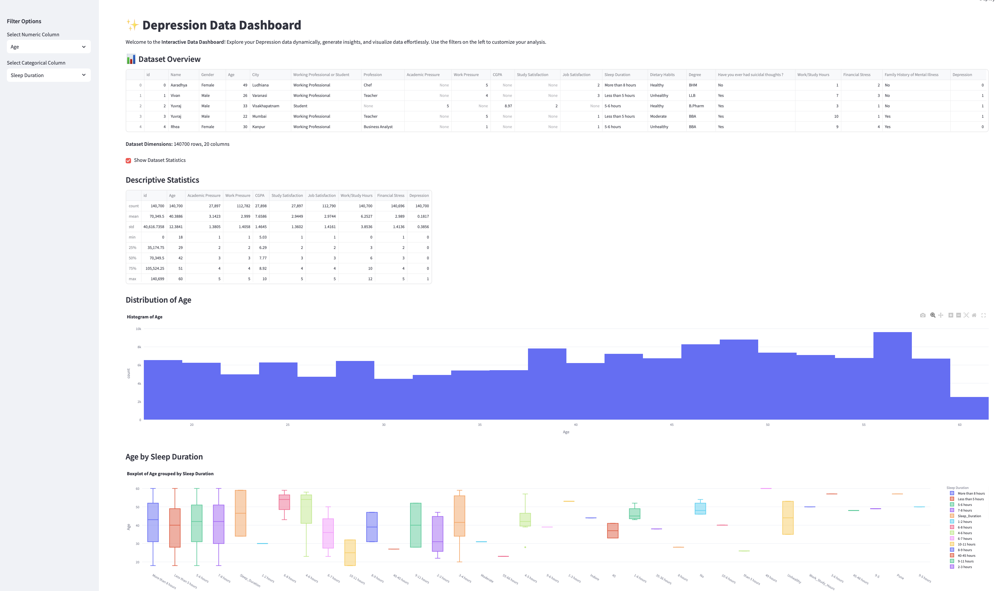
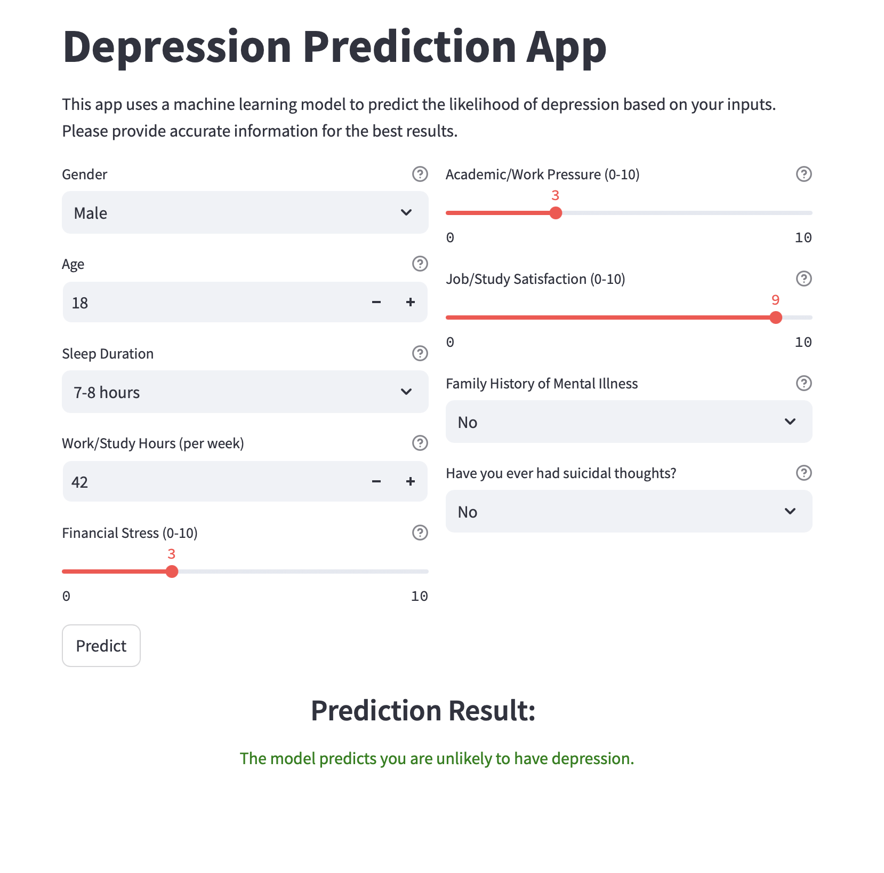

# Depression Prediction App

## Overview

This project is a **Depression Prediction App** built using **Streamlit**, **Pandas**, **NumPy**, **Scikit-learn**, and a pre-trained machine learning model. The app allows users to predict the likelihood of depression based on various input parameters, such as gender, age, sleep duration, family history, and mental health history. The prediction is powered by an ensemble machine learning model trained on a dataset of mental health indicators.

### Key Features:
- Predict the likelihood of depression based on user inputs.
- Provides results and suggestions for consultation based on the prediction.
- Built with a user-friendly web interface using Streamlit.

---

## Tech Stack

- **Python** 3.x
- **Streamlit** for the web interface
- **Pandas** and **NumPy** for data processing
- **Scikit-learn** for machine learning model
- **Joblib** for model and scaler loading
- **Gdown** for downloading model files from Google Drive (if needed)

---

## Installation

1. **Clone the repository**:
   ```bash
   git clone https://github.com/yourusername/depression-prediction-app.git
   cd depression-prediction-app


Set up a virtual environment (Optional but recommended):

Install the required dependencies:

    pip install -r requirements.txt

Download the trained model: If you're using the pre-trained model stored on Google Drive, you can download it via gdown:

    gdown https://drive.google.com/uc?id=1OSRR2QRy3sBrne9A30OqOkMZUDSeX9Ck

Run the app:

    streamlit run webapp.py

**The Dashboard**: 
   A user-friendly interface where individuals can input their symptoms or behavioral data to receive predictions on their mental health. You can check out the live dashboard   here [[Depression Dashboard](https://depresdash.streamlit.app/)
   .

**The Model Implementation**: 
   A backend system where the actual machine learning model runs and processes the input data to make predictions. You can test out the live model implementation here:          [Depression Analysis Model](https://depressanalysis.streamlit.app/).
    .
   
    
**How to Use**

   Input Information:
   Gender: Select either "Male" or "Female".
   Age: Enter your age.
   Sleep Duration: Select your average sleep duration.
   Work/Study Hours: Enter the total number of hours spent working or studying per week.
   Financial Stress: Use the slider to rate your financial stress on a scale of 0 (none) to 10 (extreme).
   Academic/Work Pressure: Use the slider to rate your academic/work pressure on a scale of 0 (none) to 10 (extreme).
   Job/Study Satisfaction: Use the slider to rate your job/study satisfaction.
   Family History of Mental Illness: Select "Yes" or "No".
   Suicidal Thoughts: Select "Yes" or "No" if you've ever had suicidal thoughts.


**Prediction**
   After providing your inputs, click the "Predict" button. The app will predict the likelihood of depression and provide a suggestion to consult a mental health professiona       if necessary.

**Model Explanation**
   The model used for prediction is an ensemble machine learning model that has been trained on a dataset containing information such as:

   Age,
   Gender,
   Sleep duration,
   Financial stress,
   Academic/work pressure,
   Family history of mental illness,
   Experience with suicidal thoughts.

**
The model predicts whether a user might be at risk for depression based on these inputs. The prediction results are displayed as either:**

_Likely to have depression (recommend consulting a mental health professional)
Unlikely to have depression_


Requirements
   Python 3.7 or above
   Required Python packages (listed in requirements.txt)

License
   This project is licensed under the MIT License - see the LICENSE file for details.
